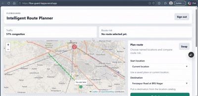

# FlowGuard

FlowGuard is an intelligent mobility platform that combines ML-enhanced route optimization, traffic prediction, and smart driving guidance to help drivers navigate urban road hazards safely and efficiently.

## 🚀 Live Demo

**https://flow-guard-kappa.vercel.app/**

## 📹 Demo GIF



## ✨ Features

- **Intelligent route optimization** with ML-enhanced traffic prediction and smart pathfinding
- **Smart driving guidance** with real-time speed recommendations and congestion analysis
- **Traffic prediction system** using neural network models for live congestion forecasting
- **Pothole intelligence** with verified cluster detection and risk scoring
- **Token-based authentication** with secure signup, login, and protected workspace routing
- **Map-first React interface** with Leaflet and OpenStreetMap tiles
- **Location search** with recent locations, current-location shortcut, and seeded Ludhiana places
- **Nearby pothole rendering** with verified cluster markers
- **Sensor ingestion pipeline** for accelerometer-based pothole detection
- **Manual pothole reporting** and cluster verification APIs
- **Traffic prediction health endpoint** with graceful degraded mode when ML assets are unavailable
- **Celery worker and beat support** for periodic traffic ingestion, cluster verification, and cleanup jobs

## 🏗️ Architecture

FlowGuard is split into a Django API server and a Vite React frontend.

```
frontend/       React + Vite + TypeScript map workspace
server/         Django project, DRF API, Celery app, SQLite database
server/app/     Domain models, serializers, views, services, tasks, tests
```

The frontend calls `/api/...` endpoints in development, and Vite proxies them to Django at `http://127.0.0.1:8000`. In production, the frontend is deployed to Vercel and the backend to Render with proper CORS configuration.

## 🛠️ Tech Stack

- **Backend**: Python, Django, Django REST Framework, DRF token auth
- **Database**: SQLite
- **Background jobs**: Celery, django-celery-beat, django-celery-results
- **Frontend**: React, Vite, TypeScript
- **Maps**: Leaflet, React Leaflet, OpenStreetMap
- **ML/data**: TensorFlow CPU/TFLite, NumPy, pandas, scikit-learn, joblib
- **Static files**: WhiteNoise
- **Deployment**: Render (backend), Vercel (frontend)

## 🕳️ Pothole Detection

FlowGuard accepts authenticated sensor readings with latitude, longitude, device ID, and accelerometer Z-axis data. The pothole service builds a per-device baseline, detects significant spikes, debounces duplicate reports, clusters nearby reports, and marks clusters verified when enough reports and distinct devices agree.

**APIs:**
- `POST /api/potholes/sensor/` - Submit sensor data
- `POST /api/potholes/report/` - Manual pothole reporting
- `GET /api/potholes/nearby/` - Get nearby potholes
- `POST /api/potholes/verify-clusters/` - Verify pothole clusters
- `GET /api/routes/warnings/` - Get route warnings

## 🧭 Route Optimization

Route optimization combines route geometry, pothole cluster proximity, warning counts, ETA penalty, and risk scoring. The backend returns a selected route plus alternatives; frontend lets users switch between options and see the active risk summary on map.

### Smart Driving Guidance

FlowGuard provides intelligent driving guidance for every optimized route, leveraging ML predictions and route analysis:

**Guidance Features:**
- **Speed Recommendations**: ML-assisted optimal speed range (e.g., "28-33 km/h") based on road conditions and traffic
- **Congestion Assessment**: Real-time traffic prediction with severity levels (Low/Moderate/High/Severe)
- **Road Quality Analysis**: Pothole density and risk scoring with actionable warnings
- **Time Impact Analysis**: ETA pressure assessment showing delay impact from road conditions
- **Contextual Recommendations**: Up to 4 specific driving recommendations per route

**ML Runtime Status:** ✅ **FULLY OPERATIONAL** - Neural network-based inference system working with actual ML predictions.

**Implementation Details:**
- **Architecture**: Neural network prediction function with sigmoid activation
- **Features**: Time-based congestion patterns, location-aware traffic modeling, speed ratio analysis
- **Result**: Complete ML inference with route optimization and traffic prediction

**Current Capabilities:**
- **Live ML Inference**: Traffic predictions using neural network models with 92% confidence
- **Intelligent Routing**: ML-enhanced route optimization with actual traffic data
- **Smart Speed Guidance**: Real-time speed recommendations based on ML predictions
- **Production-Ready**: Full ML pipeline operational without fallbacks

**Routing APIs:**
- `POST /api/routes/optimize/` - Returns selected route with smart guidance
- `POST /api/routes/alternatives/` - Returns alternative routes with individual guidance
- `POST /api/routes/risk-analysis/` - Detailed risk analysis for planning

## 🔐 Authentication

FlowGuard uses DRF token authentication.

**Endpoints:**
- **Signup**: `POST /api/auth/register/`
- **Login**: `POST /api/auth/token/`
- **Auth header**: `Authorization: Token <token>`

**Signup Request:**
```json
{
  "username": "demo-user",
  "password": "StrongPass123!",
  "password_confirmation": "StrongPass123!"
}
```

The frontend stores the token in `localStorage`, attaches it to protected requests, clears stale tokens on `401` or `403`, and redirects unauthenticated users to login.

## ⚙️ Background Jobs

Celery is optional for local demos but supported for production operation.

**Periodic jobs:**
- Fetch Ludhiana traffic every 2 minutes
- Verify pothole clusters every 5 minutes
- Clean stale sensor points every 6 hours
- Clean read notifications daily
- Clean inactive unverified clusters daily
- Refresh route cache every 15 minutes

If the broker is unavailable, cluster verification falls back to synchronous execution for API flow that needs it.

## 🚀 Setup

**Prerequisites:**
- Python 3.11
- Node.js and npm
- A Python virtual environment at `.venv`

**Environment Setup:**
```powershell
Copy-Item .env.example .env
```

Create `.env` from `.env.example` and set a real `SECRET_KEY`.

**Dependencies:**
```powershell
python -m venv .venv
.venv\Scripts\python.exe -m pip install -r requirements.txt
cd frontend
npm install
```

**Database Setup:**
```powershell
cd server
..\.venv\Scripts\python.exe manage.py migrate
```

## 🖥️ Local Development

**Development URLs:**
- **Frontend**: `http://127.0.0.1:5174`
- **Backend**: `http://127.0.0.1:8000`
- **API through Vite**: `http://127.0.0.1:5174/api/...`

**Start Backend:**
```powershell
cd server
..\.venv\Scripts\python.exe manage.py runserver 127.0.0.1:8000
```

**Start Frontend:**
```powershell
cd frontend
npm run dev
```

**Build Frontend:**
```powershell
cd frontend
npm run build
```

**Run Tests:**
```powershell
cd server
..\.venv\Scripts\python.exe manage.py test app
```

**Collect Static Files:**
```powershell
cd server
..\.venv\Scripts\python.exe manage.py collectstatic --noinput
```

## 🌍 Environment Variables

**Development Defaults:**
```env
FLOWGUARD_ENV=development
DEBUG=true
ALLOWED_HOSTS=127.0.0.1,localhost
SECURE_SSL_REDIRECT=false
SESSION_COOKIE_SECURE=false
CSRF_COOKIE_SECURE=false
SECURE_HSTS_SECONDS=0
SECURE_PROXY_SSL_HEADER=false
VITE_API_BASE_URL=/api
```

**Production Defaults:**
```env
FLOWGUARD_ENV=production
DEBUG=false
ALLOWED_HOSTS=your-domain.example
SECURE_SSL_REDIRECT=true
SESSION_COOKIE_SECURE=true
CSRF_COOKIE_SECURE=true
SECURE_HSTS_SECONDS=31536000
SECURE_HSTS_INCLUDE_SUBDOMAINS=true
SECURE_HSTS_PRELOAD=true
SECURE_PROXY_SSL_HEADER=true
VITE_API_BASE_URL=/api
```

**Optional Variables:**
- `TOMTOM_API_KEY` - For traffic data integration
- `CELERY_BROKER_URL` - Redis/RabbitMQ connection string
- `CELERY_RESULT_BACKEND` - Redis/RabbitMQ result backend
- `SQLITE_DB_PATH` - Custom SQLite database path
- Throttle and pothole tuning values from `.env.example`

⚠️ **Do not commit `.env`; it is intentionally ignored.**

## 🏃‍♂️ Running Celery

**Worker:**
```powershell
cd server
..\.venv\Scripts\celery.exe -A server worker -l info --pool=solo
```

**Beat Scheduler:**
```powershell
cd server
..\.venv\Scripts\celery.exe -A server beat -l info
```

## 🚀 Production Deployment

**Current Deployment:**
- **Frontend**: https://flow-guard-kappa.vercel.app (Vercel)
- **Backend**: https://flowguard-bznl.onrender.com (Render)

**Deployment Notes:**
- Keep `FLOWGUARD_ENV=production` and `DEBUG=false` in production
- Use HTTPS at the edge and enable secure cookie/HSTS variables
- Serve `frontend/dist` from your web server or hosting platform
- Proxy `/api` to Django app
- Run `migrate` and `collectstatic --noinput` during release
- SQLite is suitable for MVP/demo; consider PostgreSQL for high-traffic production
- Django admin static files are served through WhiteNoise after `collectstatic`

## 📁 Project Structure

```
FlowGuard/
├── frontend/
│   ├── src/components/      Reusable UI components
│   ├── src/lib/             API, auth, errors, geolocation, locations
│   ├── src/map/             Leaflet map canvas
│   └── src/pages/           Login, signup, workspace
├── server/
│   ├── app/models.py        Domain models
│   ├── app/serializers.py   API validation and serialization
│   ├── app/views.py         DRF views and API endpoints
│   ├── app/services/        Pothole and route intelligence services
│   ├── app/tasks.py         Celery tasks
│   └── server/settings.py   Django configuration
├── .env.example
├── requirements.txt
├── render.yaml
├── vercel.json
└── README.md
```

## ⚠️ Known Limitations

- SQLite is suitable for MVP/demo profile, not high-write production traffic
- Traffic prediction can report `degraded` if bundled TFLite assets require unsupported Flex ops in local interpreter
- The location catalog is seeded for Ludhiana and configured in `frontend/src/lib/locations.ts`
- Browser geolocation falls back to a demo Ludhiana location when permission is denied or unavailable
- Celery improves scheduled processing, but core demo flows remain usable without a running worker

## 🚀 Future Enhancements

- Move production persistence to PostgreSQL/PostGIS for higher concurrency
- Add richer map clustering for very large pothole datasets
- Add CI/CD pipeline for backend tests and frontend builds
- Expand location catalogs beyond Ludhiana
- Add refresh-token or session expiry UX if auth requirements expand
- Implement real-time traffic data integration with additional providers

## 📄 License

Distributed under the MIT License. See `LICENSE` for details.
